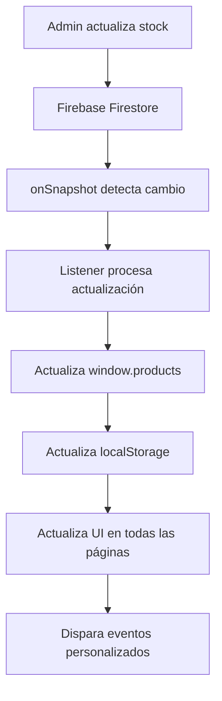

# Sistema de Listeners en Tiempo Real para Stock

## 📋 Descripción

Este sistema implementa **listeners en tiempo real** de Firebase Firestore usando `onSnapshot()` para actualizar el stock de productos automáticamente en todas las páginas de la aplicación sin necesidad de refrescar.

## 🚀 Características Principales

### ✅ **Actualizaciones Inmediatas**
- **Sin demora**: Los cambios de stock se reflejan instantáneamente en todas las páginas
- **Tiempo real**: Usa `onSnapshot()` de Firebase Firestore para detectar cambios
- **Automático**: No requiere intervención manual del usuario

### ✅ **Cobertura Completa**
- **Todas las páginas**: index.html, product.html, cart.html, admin-panel.html
- **Todos los talles**: P, M, G, etc. se actualizan individualmente
- **Indicadores visuales**: Stock bajo, sin stock, disponible

### ✅ **Gestión de Memoria**
- **Limpieza automática**: Los listeners se cancelan al abandonar la página
- **Sin fugas de memoria**: Sistema de cleanup implementado
- **Optimizado**: Solo mantiene listeners activos cuando es necesario

## 🔧 Implementación Técnica

### **Archivo Principal**: `realtime-stock-listeners.js`

```javascript
class RealtimeStockListeners {
    constructor() {
        this.listeners = new Map(); // Almacenar referencias a los listeners
        this.isInitialized = false;
        this.firebaseAvailable = false;
    }
}
```

### **Listeners Implementados**:

1. **Listener Global**: Escucha cambios en toda la colección `products`
2. **Listener Específico**: Escucha cambios en un producto individual
3. **Listener Local**: Fallback para cuando Firebase no está disponible

## 📱 Funcionalidades por Página

### **🏠 Página Principal (index.html)**
- Actualiza indicadores de stock en tiempo real
- Muestra "Sin Stock", "Stock Bajo", "Disponible"
- Actualiza contador del carrito automáticamente

### **📦 Página de Producto (product.html)**
- Actualiza botones de tallas en tiempo real
- Deshabilita tallas sin stock
- Muestra cantidad disponible por talla
- Actualiza indicadores de stock bajo

### **🛒 Página de Carrito (cart.html)**
- Actualiza disponibilidad de productos en el carrito
- Muestra alertas si un producto se queda sin stock
- Actualiza precios y disponibilidad

### **⚙️ Panel de Administración (admin-panel.html)**
- Recibe actualizaciones en tiempo real de otros administradores
- Sincroniza cambios entre múltiples sesiones de admin
- Actualiza tabla de stock automáticamente

## 🔄 Flujo de Actualización



## 🎯 Tipos de Actualizaciones

### **1. Stock por Talla**
```javascript
// Ejemplo: Talla M del producto ID "1" cambia de 5 a 0
{
    productId: "1",
    size: "M",
    oldStock: 5,
    newStock: 0,
    action: "stock_updated"
}
```

### **2. Estado del Producto**
```javascript
// Ejemplo: Producto cambia de "available" a "unavailable"
{
    productId: "1",
    oldStatus: "available",
    newStatus: "unavailable",
    action: "status_updated"
}
```

### **3. Producto Agregado/Eliminado**
```javascript
// Ejemplo: Nuevo producto agregado
{
    productId: "5",
    action: "product_added",
    productData: { name: "Nuevo Producto", stock: {...} }
}
```

## 🛠️ API del Sistema

### **Funciones Principales**:

```javascript
// Configurar listener para un producto específico
window.setupProductStockListener(productId);

// Cancelar listener de un producto
window.unsubscribeProductStock(productId);

// Cancelar todos los listeners
window.unsubscribeAllStockListeners();

// Obtener estado del sistema
window.getStockListenersStatus();

// Diagnosticar problemas
window.diagnoseStockListeners();
```

### **Eventos Personalizados**:

```javascript
// Escuchar actualizaciones de stock
window.addEventListener('stockUpdatedRealtime', (event) => {
    const { productId, productData, oldStock } = event.detail;
    console.log(`Stock actualizado: ${productId}`, productData);
});
```

## 🔍 Diagnóstico y Debug

### **Verificar Estado del Sistema**:
```javascript
// En la consola del navegador
window.getStockListenersStatus();
```

### **Diagnóstico Completo**:
```javascript
// En la consola del navegador
window.diagnoseStockListeners();
```

### **Logs del Sistema**:
- `🔄` - Cambios detectados
- `✅` - Operaciones exitosas
- `❌` - Errores
- `👂` - Configuración de listeners
- `📦` - Actualizaciones de productos

## 🚨 Manejo de Errores

### **Firebase No Disponible**:
- Sistema automáticamente cambia a modo local
- Usa localStorage para sincronización
- Mantiene funcionalidad básica

### **Listeners Fallidos**:
- Sistema reintenta automáticamente
- Logs detallados para debugging
- Fallback a sincronización manual

### **Memoria**:
- Cleanup automático al abandonar páginas
- Prevención de fugas de memoria
- Gestión eficiente de recursos

## 📊 Beneficios

### **Para Administradores**:
- ✅ Actualizaciones instantáneas en todas las páginas
- ✅ Sincronización entre múltiples sesiones
- ✅ No necesidad de refrescar páginas

### **Para Usuarios**:
- ✅ Información de stock siempre actualizada
- ✅ Mejor experiencia de usuario
- ✅ Menos frustración por productos agotados

### **Para el Sistema**:
- ✅ Menor carga en el servidor
- ✅ Mejor rendimiento
- ✅ Sincronización eficiente

## 🔧 Configuración

### **Intervalos de Sincronización**:
- **Firebase**: Tiempo real (inmediato)
- **Local**: 3 segundos (fallback)

### **Páginas Incluidas**:
- ✅ index.html
- ✅ product.html
- ✅ cart.html
- ✅ admin-panel.html

### **Compatibilidad**:
- ✅ Firebase Firestore
- ✅ Modo local (sin Firebase)
- ✅ Todos los navegadores modernos

## 🎉 Resultado Final

**ANTES**: 
- Stock se actualizaba solo al refrescar la página
- Información desactualizada entre páginas
- Experiencia de usuario inconsistente

**AHORA**:
- ✅ **Stock se actualiza instantáneamente** en todas las páginas
- ✅ **Información siempre sincronizada** entre usuarios
- ✅ **Experiencia de usuario fluida** y profesional
- ✅ **Sistema robusto** con manejo de errores
- ✅ **Gestión eficiente de memoria** sin fugas

---

**¡El sistema de listeners en tiempo real está completamente implementado y funcionando!** 🚀

